This guide provides step-by-step instructions for installing Berserk Arch Linux as a guest operating system in Virtual Machines, optimized for penetration testing and security research.

## Installation

After booting into the live iso, you'll see the **Berserk Welcome** screen.

From here we can take either of 2 ways:

1. Easy Installation (Offline)
2. Advanced Install (Online) -- (_Coming Soon_)

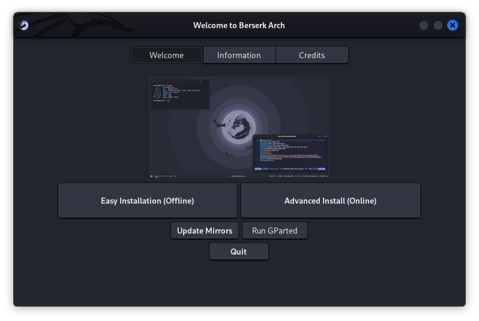

### Starting the _Easy Installation_ (offline)

- Click On `Easy Installation (Offline)` button to launch the installer.

#### Installation

1. Choose the preferred language and click next

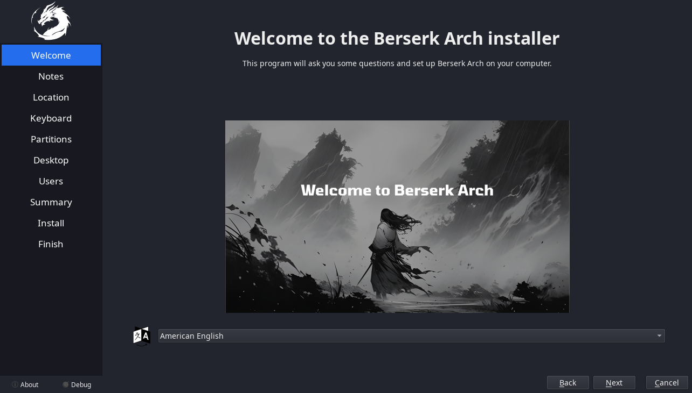

 

2. This is the latest release -- read and click next

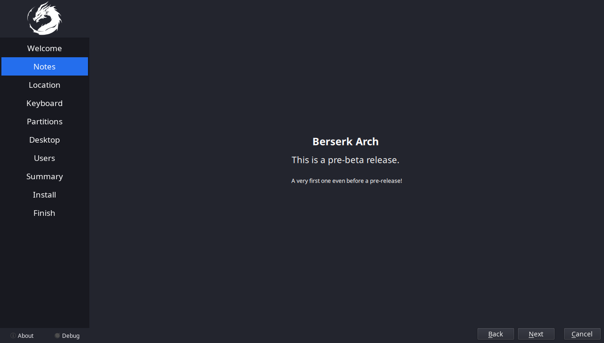

 

3. Choose your region and timezone, either through clicking on the map or through the dropdown menu

- proceed with clicking next

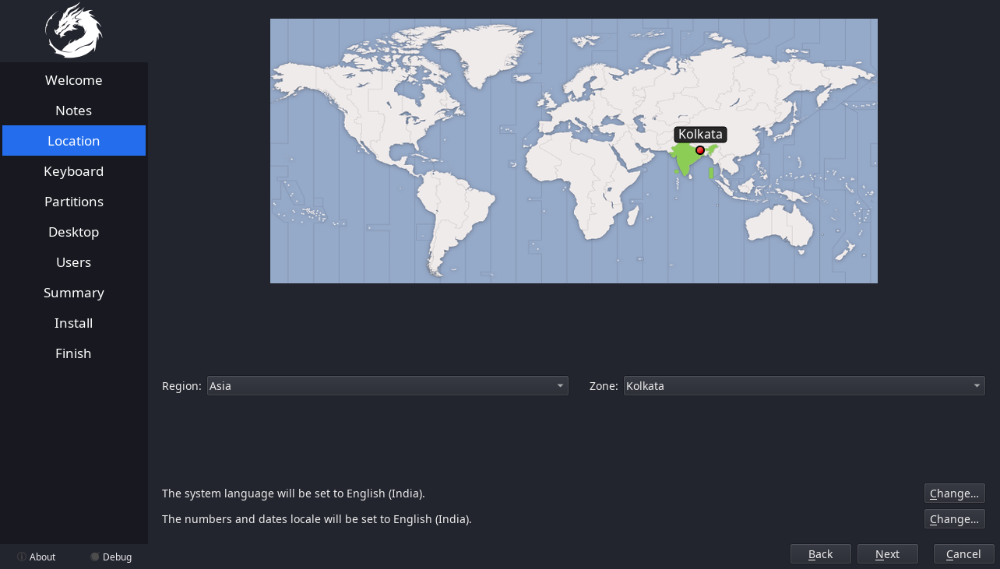

 

4. Select the correct keyboard layout and click next

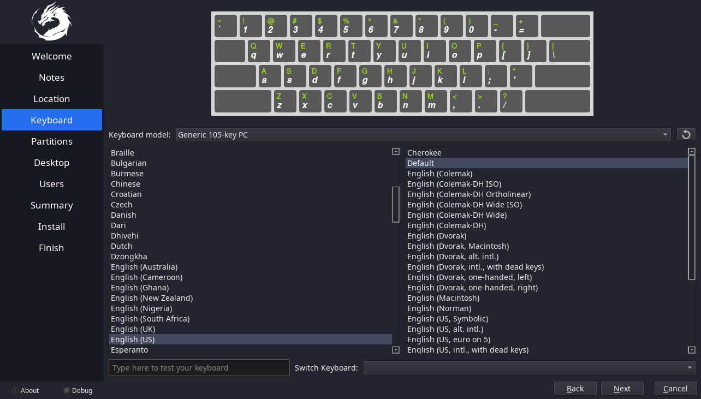

 

5. Now at partitioning part, we have several options
   1. **Erase disk**
      - Now Select The swap type or no swap from the dropdown menu
      - Select the filesystem from the next dropdown.

   2. **Manual Partitioning**
      - _Coming Soon..._
      - If you've chosen this, you know what you're doing 😌
      - You can use `cfdisk`, `gdisk`, `fdisk`, `gparted`, or anything else and later selete each partition in calamares menu, your choice...

   3. **Now Choose if you want to `encrypt system`**
      - Click on the checkbox
      - Enter the password

   Now click next

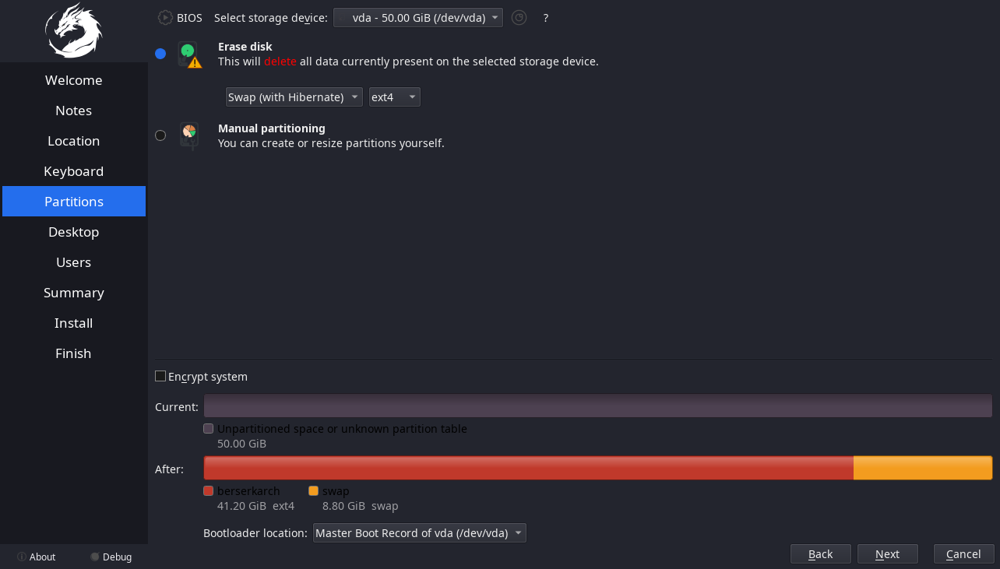

 

6. Choose the desired DE or WM
   - Available Options are:
     1. XFCE
     2. GNOME
     3. I3 WM
     4. Hyprland

   Now click next

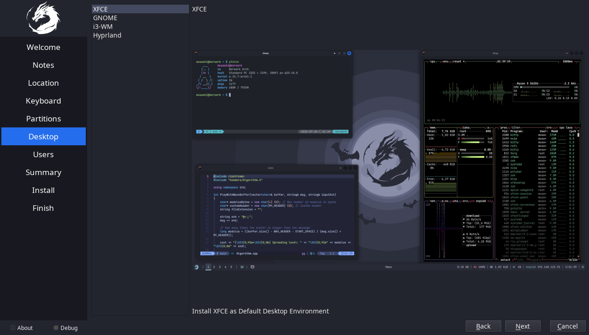

 

7. Now create the user
   - Fill in the name
   - Username
   - hostname of the system
   - type and retype the password

   Then again click Next

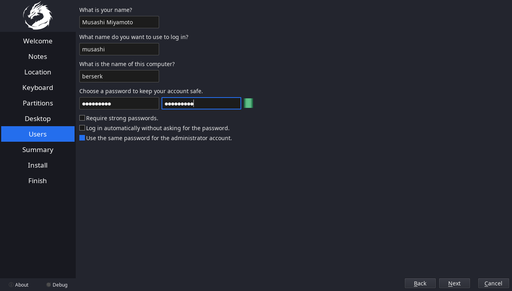

 

8. This is the summary of your chosen options
   - If satisfied, click Install
   - else, click back and change what you like.

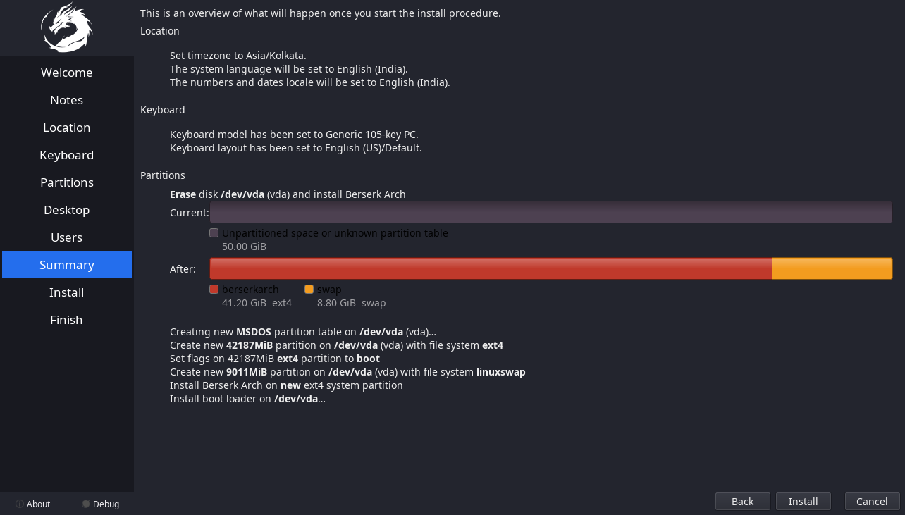

 

9. The installation is going to take a while, just wait for it

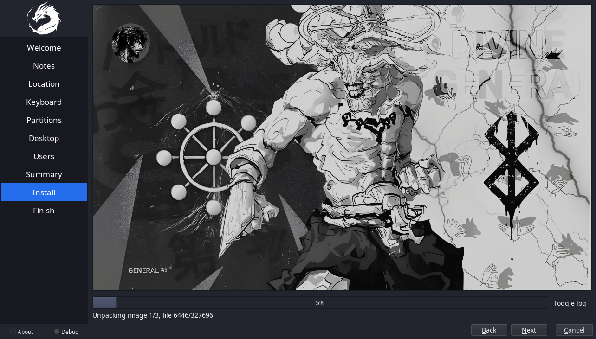

 

10. Click on Reboot to reboot the system.

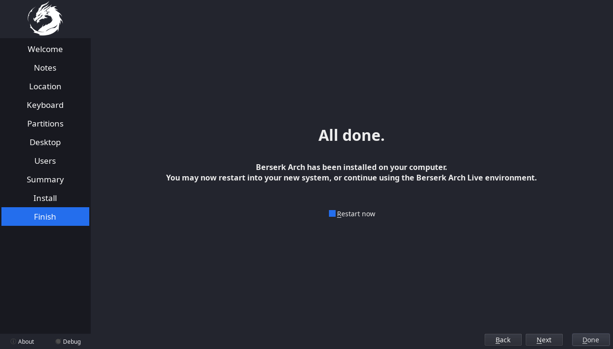

## Finish

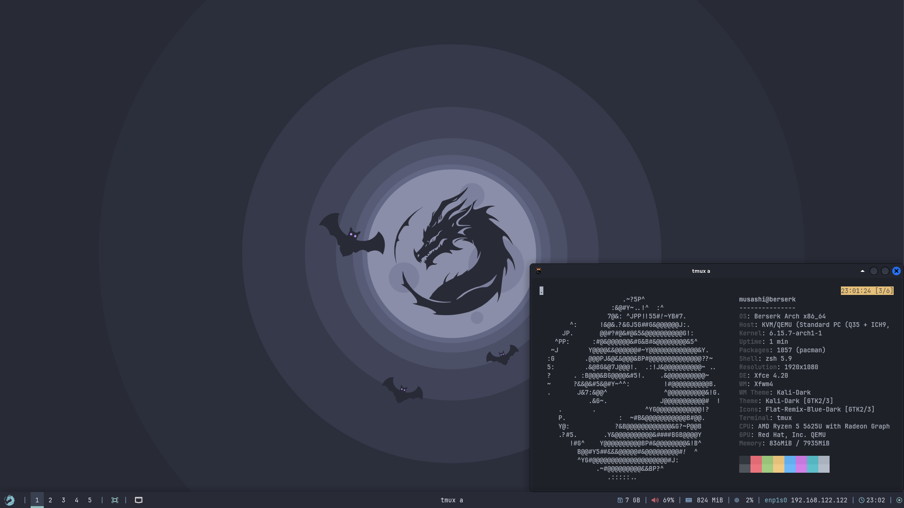

and Now we have installed Berserk Arch.
